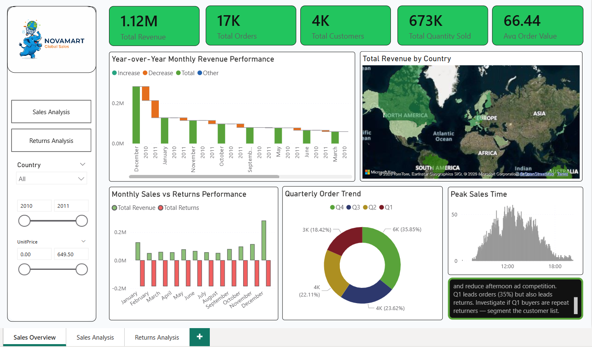
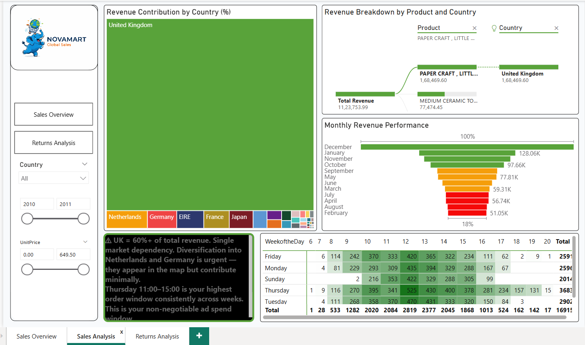
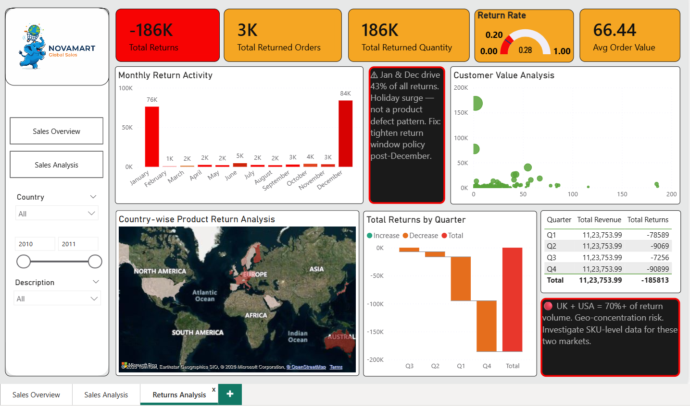

# FUTURE_DS_01
NovaMart Global Sales | 3-tab Power BI dashboard | Power Query + DAX | Revenue risk &amp; returns analysis | FutureIntern #FUTURE_DS_01
powerbi  power-query  dax  data-analytics  sales-dashboard  data-visualization  futureintern  internship  ecommerce-analytics  business-intelligence
# FUTURE_DS_01 — NovaMart Global Sales Dashboard | Power BI

> **FutureIntern Data Science & Analytics Track | Task 1**  
> A 3-tab executive sales intelligence dashboard built in Power BI,  
> designed to surface not just performance metrics but business risk  
> and decision triggers.

---
## Business Questions & Insights

1. How is overall revenue performing over time?
Ans.
Revenue shows a strong upward trend from 2010 to 2011, indicating rapid business growth.
| Key Insights |
Revenue increased significantly in 2011 compared to 2010.
Sales peak toward the end of the year, indicating seasonal demand.

2. Which months generate the highest sales?
Ans.
Sales peak during the final quarter of the year.
| Key Insights |
November records the highest revenue.
Sales begin increasing from September and reach maximum levels in November and December.

3. Which countries contribute the most revenue?
Ans.
The majority of revenue comes from the United Kingdom.
| Key Insights |
The UK dominates overall sales.
European countries such as Netherlands, Germany, and France contribute smaller but consistent revenue.

4. Who are the most valuable customers?
Ans.
A small group of customers generates a large share of total revenue.
| Key Insights |
Top customers contribute significantly higher revenue than average customers.
Retaining these high-value customers is critical for long-term growth.

5. Which products are most frequently purchased?
Ans.
Certain products consistently appear in high quantities across invoices.
| Key Insights |
High-demand items drive large portions of sales volume.
Maintaining inventory for popular products is essential.

6. What is the impact of product returns?
Ans.
Returns reduce overall revenue and indicate potential operational issues.
| Key Insights |
Returned orders appear as negative quantities or cancelled invoices.
Monitoring return rates can help identify product or delivery issues.

## 📁 Repository Info

| Field | Detail |
|---|---|
| Track | Data Science & Analytics |
| Track Code | DS |
| Task Number | 01 |
| Repository Name | FUTURE_DS_01 |
| CIN ID | FIT/FEB26/DS13829 |
| Intern | [Sai Kushal Bachu] |

---

## 📊 Dashboard Overview

| Metric | Value |
|---|---|
| Total Revenue | 1.12M |
| Total Orders | 17K |
| Total Customers | 4K |
| Total Quantity Sold | 673K |
| Avg Order Value | 66.44 |
| Return Rate | 20% |

---

## 🔧 Data Pipeline — Power Query (ETL)

Before any visual was built, the raw dataset went through a full
cleaning and transformation pipeline using Power Query:

- Removed nulls, duplicates and inconsistent formatting
- Standardized date columns for time-intelligence functions
- Transformed and typed all numeric fields correctly
- Structured relational model for cross-tab filtering
- Prepared calculated columns for DAX measures downstream

> Clean data is the foundation. Everything else follows.

---

## 📋 Dashboard Tabs

### Tab 1 — Sales Overview
- Year-over-Year Monthly Revenue Performance
- Revenue by Country (Map)
- Monthly Sales vs Returns (side-by-side bar)
- Quarterly Order Trend (donut)
- Peak Sales Time (histogram — hour-level granularity)

**Key Insight:** Peak order window is 12:00–18:00.
Afternoon is your highest-competition ad slot — bid strategy should
account for this.

---

### Tab 2 — Sales Analysis
- Revenue Contribution by Country (Treemap)
- Revenue Breakdown by Product and Country (Sankey/Flow)
- Monthly Revenue Performance (waterfall/ranked bar)
- Week × Hour order heatmap

**Key Findings:**
- UK = 60%+ of revenue. Single market dependency is the #1 strategic risk.
- Top product: Paper Craft at ₹1,68,469
- Thursday 11:00–15:00 is the highest-order window consistently.
  This is the non-negotiable ad spend slot.
- December and January are peak revenue months.
  November and October are acceleration months worth targeting.

---

### Tab 3 — Returns Analysis
- Monthly Return Activity (bar — Jan and Dec spike)
- Country-wise Product Return Map
- Total Returns by Quarter
- Customer Value Analysis (scatter)
- Quarter-level Revenue vs Returns table

**Key Findings:**
- Total Returns: -186K | Total Returned Orders: 3K
- Jan + Dec = 43% of all returns → holiday surge, not product defect
- UK + USA = 70%+ of return volume → geo-concentration risk
- Q4 return spike (-90K) should trigger post-holiday return window
  policy review
- Q1 leads orders AND returns — investigate if Q1 buyers are repeat
  returners before scaling Q1 acquisition spend

---

## 💡 Business Recommendations Surfaced

| # | Finding | Recommended Action |
|---|---|---|
| 1 | UK = 60%+ revenue | Urgent geographic diversification — prioritize NL and DE |
| 2 | Jan/Dec drive 43% returns | Tighten return window policy post-December |
| 3 | Q1 high orders + high returns | Segment Q1 buyers before scaling ad budget |
| 4 | Thursday 11–15 peak window | Fix ad spend here, reduce afternoon competition cost |
| 5 | Paper Craft leads revenue | Focus portfolio and cross-sell strategy on this SKU |
| 6 | UK + USA = 70% of returns | SKU-level return audit for these two markets |

---

## 🛠️ Tools Used

| Tool | Purpose |
|---|---|
| Power BI Desktop | Dashboard design & publishing |
| Power Query | Data cleaning, formatting & transformation (ETL) |
| DAX | Calculated columns, measures, time-intelligence |
| Bing Maps | Geographic revenue & returns mapping |
| AI Insight Cards | Embedded analytical commentary per tab |

---

## 📸 Screenshots

### Tab 1 — Sales Overview


### Tab 2 — Sales Analysis


### Tab 3 — Returns Analysis


---

## 📂 File Structure
```
FUTURE_DS_01/
│
├── NovaMart_GlobalSales.pbix        # Main Power BI file
├── /screenshots
│   ├── sales_overview.png
│   ├── sales_analysis.png
│   └── returns_analysis.png
├── /data
│   └── novamart_raw_data.xlsx       # Source data (anonymized)
└── README.md
```

---

## 👤 Author

**[Sai Kushal Bachu]**
CIN ID: FIT/FEB26/DS13829
FutureIntern — Data Science & Analytics Track

[www.linkedin.com/in/sai-kushal-bachu-b0a390269] 

---

## 📄 License

MIT
